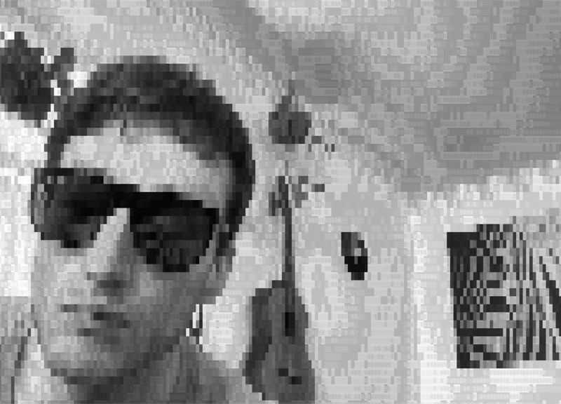

# term-cam

Real-time webcam-to-ASCII renderer for macOS terminals.

`term-cam` captures FaceTime HD or external USB webcam video using `AVFoundation`, rescales the frames to match the terminal columns/rows on the fly, and outputs raw Unicode shade blocks dithered with ANSI 256-color escape codes.



## Features

- **AVFoundation Backend**: Migrated from deprecated `QTKit` for compatibility with modern macOS.
- **Zero Heap Allocations**: Frames are formatted via direct pointer arithmetic on `32BGRA` pixel bytes inside a reused C-buffer to minimize CPU overhead.
- **Dynamic Resizing**: Standard `ioctl` window-size detection adjusts frame interpolation automatically.
- **Mirrored Capture**: Horizontally flips the frame for an intuitive webcam feed.
- **Adjustable Resolution**: Supports runtime scale factors for custom pixelation/lofi rendering.

## Requirements

- **OS**: macOS 10.15 (Catalina) or later.
- **Prerequisites**: Xcode Command Line Tools (requires `clang` with ARC support).

## Getting Started

1. Clone and build:
   ```bash
   git clone https://github.com/jakegarrison/term-cam.git
   cd term-cam
   make
   ```
2. Execute:
   ```bash
   ./term-cam [record-interval-seconds]
   ```
   * *`record-interval-seconds` is optional (default: off). Provide a value `> 0` (e.g. `10`) to periodically record frames to the git-ignored `capture/` directory.*

> [!NOTE]
> The terminal application (e.g. Terminal.app, iTerm2) will request camera access permissions on initial launch.

## Key Controls

While `term-cam` is running, you can press the following keys to adjust settings live:

- **`h` or `?`**: Toggle the help menu overlay.
- **`q` or `Esc`**: Exit the application cleanly.
- **`s`**: Save a manual screenshot (ANSI frame) to the `capture/` directory.
- **`Spacebar`**: Pause / unpause webcam rendering.
- **`m`**: Cycle mirror modes (`None` -> `Horiz` (Standard) -> `HorizSplit` -> `VertSplit`).
- **`c`**: Cycle color maps (11 themes: `Grayscale`, `Color`, `Green`, `Amber`, `Rainbow`, `Cyan`, `Red`, `Psychedelic`, `InvertedGray`, `Magenta`, `Spectral`).
- **`[` or `]`**: Decrease / increase contrast factor.
- **`+` or `=`**: Increase resolution (decrease pixel block size).
- **`-`**: Decrease resolution (increase pixel block size).

## Makefile Targets

- `make`: Compile binary (`term-cam`).
- `make run`: Compile and run default highest quality.
- `make record`: Compile and run, capturing frames to `capture/` every 10 seconds.
- `make render`: Bulk render all captured `.ansi` files in `capture/` to `.jpg` images.
- `make help`: Print build targets and runtime key controls.
- `make clean`: Remove compilation artifacts and the `capture/` directory.
- `make install`: Install binary globally to `/usr/local/bin`.
- `make uninstall`: Remove binary from `/usr/local/bin`.

## Credits

- Licensed under MIT.
- Forked and modernized from the original [txtcam](https://github.com/dhotson/txtcam) by Dennis Hotson.
